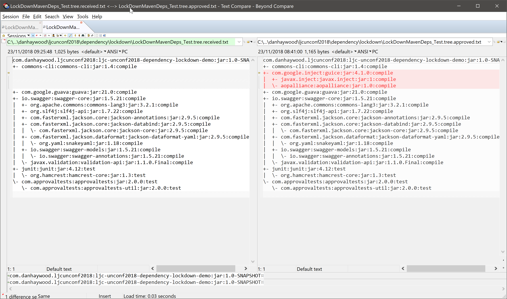

= Maven Dependency Lockdown

This repo demonstrates a simple way using to ensure that Maven dependencies can be locked down.

* Any change to the classpath (eg by adding a new `<dependency>` or changing the version of an existing `<dependency>`) will result in the tests failing.

* The change in classpath can be easily reviewed and the change then approved (ie accepted) if it was intentional.

The implementation is very simple, using the JUnit, the link:https://github.com/approvals/ApprovalTests.Java[Approval Tests] library, and the link:https://maven.apache.org/plugins/maven-dependency-plugin/[Maven dependency plugin].

To demo:

* prereqs: install a graphical diff tool, lots are supported for link:https://github.com/approvals/ApprovalTests.Java/blob/master/approvaltests/src/main/java/org/approvaltests/reporters/windows/WindowsDiffReporter.java[Windows] and link:https://github.com/approvals/ApprovalTests.Java/blob/master/approvaltests/src/main/java/org/approvaltests/reporters/macosx/MacDiffReporter.java[Mac] (otherwise will fall back to a text report in JUnit).

* lockdown should pass:
+
[source,bash]
----
mvn clean install -Dlockdown
----

* update any `<dependency>` in the pom

* running lockdown again should fail:
+
[source,bash]
----
mvn clean install -Dlockdown
----

* Review the changes, use the diff tool to inspect the differences and update the approvals file:
+

* run lockdown once more, should pass:
+
[source,bash]
----
mvn clean install -Dlockdown
----
